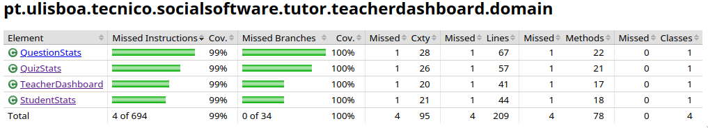
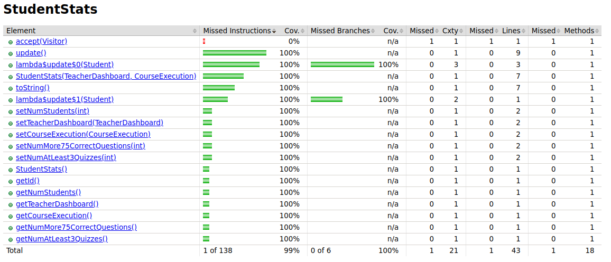
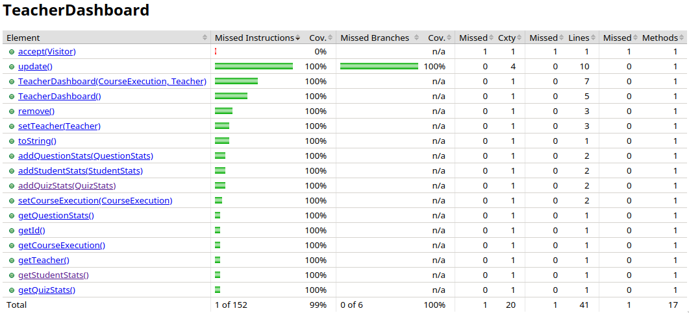
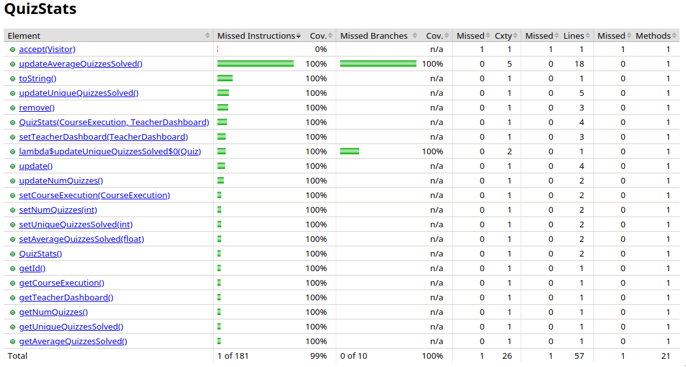
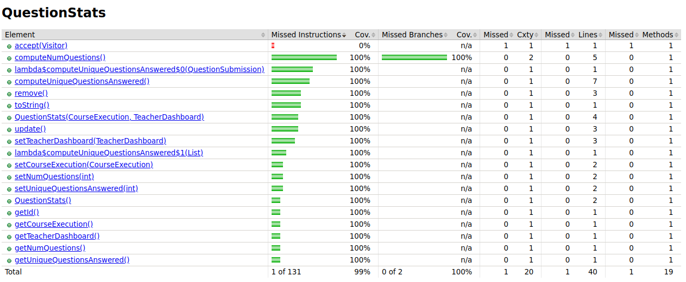

# ES P1 submission, Group 39

## Feature ESA

### Subgroup
 - Carlota Tracana, ist199059, [GitLab link](https://gitlab.rnl.tecnico.ulisboa.pt/ist199059)
   + Issues assigned: [#2](https://gitlab.rnl.tecnico.ulisboa.pt/es/es23-39/-/issues/2), [#8](https://gitlab.rnl.tecnico.ulisboa.pt/es/es23-39/-/issues/8), [#9](https://gitlab.rnl.tecnico.ulisboa.pt/es/es23-39/-/issues/9), [#10](https://gitlab.rnl.tecnico.ulisboa.pt/es/es23-39/-/issues/10), [#33](https://gitlab.rnl.tecnico.ulisboa.pt/es/es23-39/-/issues/33), [#34](https://gitlab.rnl.tecnico.ulisboa.pt/es/es23-39/-/issues/34)
 - Henrique Silva, ist199082, [GitLab link](https://gitlab.rnl.tecnico.ulisboa.pt/ist199082)
   + Issues assigned: [#2](https://gitlab.rnl.tecnico.ulisboa.pt/es/es23-39/-/issues/2), [#3](https://gitlab.rnl.tecnico.ulisboa.pt/es/es23-39/-/issues/3), [#4](https://gitlab.rnl.tecnico.ulisboa.pt/es/es23-39/-/issues/4), [#5](https://gitlab.rnl.tecnico.ulisboa.pt/es/es23-39/-/issues/5), [#6](https://gitlab.rnl.tecnico.ulisboa.pt/es/es23-39/-/issues/6), [#7](https://gitlab.rnl.tecnico.ulisboa.pt/es/es23-39/-/issues/7), [#33](https://gitlab.rnl.tecnico.ulisboa.pt/es/es23-39/-/issues/33), [#34](https://gitlab.rnl.tecnico.ulisboa.pt/es/es23-39/-/issues/34)

### Merge requests associated with this feature

The list of pull requests associated with this feature is:

 - [MR #1](https://gitlab.rnl.tecnico.ulisboa.pt/es/es23-39/-/merge_requests/1)
 - [MR #4](https://gitlab.rnl.tecnico.ulisboa.pt/es/es23-39/-/merge_requests/4)
 - [MR #5](https://gitlab.rnl.tecnico.ulisboa.pt/es/es23-39/-/merge_requests/5)

### Test Coverage Screenshot

The screenshot includes the test coverage results associated with the new/changed entities:

---

## Feature ESQ

### Subgroup
 - Carlota Barradas, ist199060, [GitLab link](https://gitlab.rnl.tecnico.ulisboa.pt/ist199060)
   + Issues assigned: [#11](https://gitlab.rnl.tecnico.ulisboa.pt/es/es23-39/-/issues/11), [#17](https://gitlab.rnl.tecnico.ulisboa.pt/es/es23-39/-/issues/17), [#18](https://gitlab.rnl.tecnico.ulisboa.pt/es/es23-39/-/issues/18), [#19](https://gitlab.rnl.tecnico.ulisboa.pt/es/es23-39/-/issues/19), [#30](https://gitlab.rnl.tecnico.ulisboa.pt/es/es23-39/-/issues/30), [#31](https://gitlab.rnl.tecnico.ulisboa.pt/es/es23-39/-/issues/31), [#33](https://gitlab.rnl.tecnico.ulisboa.pt/es/es23-39/-/issues/33), [#34](https://gitlab.rnl.tecnico.ulisboa.pt/es/es23-39/-/issues/34)
 - Pedro Lobo, ist199115, [GitLab link](https://gitlab.rnl.tecnico.ulisboa.pt/ist199115)
   + Issues assigned: [#11](https://gitlab.rnl.tecnico.ulisboa.pt/es/es23-39/-/issues/11), [#12](https://gitlab.rnl.tecnico.ulisboa.pt/es/es23-39/-/issues/12), [#13](https://gitlab.rnl.tecnico.ulisboa.pt/es/es23-39/-/issues/13), [#14](https://gitlab.rnl.tecnico.ulisboa.pt/es/es23-39/-/issues/14), [#15](https://gitlab.rnl.tecnico.ulisboa.pt/es/es23-39/-/issues/15), [#16](https://gitlab.rnl.tecnico.ulisboa.pt/es/es23-39/-/issues/16), [#33](https://gitlab.rnl.tecnico.ulisboa.pt/es/es23-39/-/issues/33), [#34](https://gitlab.rnl.tecnico.ulisboa.pt/es/es23-39/-/issues/34)

### Merge requests associated with this feature

The list of pull requests associated with this feature is:

 - [MR #2](https://gitlab.rnl.tecnico.ulisboa.pt/es/es23-39/-/merge_requests/2)
 - [MR #5](https://gitlab.rnl.tecnico.ulisboa.pt/es/es23-39/-/merge_requests/5)

### Test Coverage Screenshot

The screenshot includes the test coverage results associated with the new/changed entities:

---

## Feature ESP

### Subgroup
 - André Torres, ist199053, [GitLab link](https://gitlab.rnl.tecnico.ulisboa.pt/ist199053)
   + Issues assigned: [#20](https://gitlab.rnl.tecnico.ulisboa.pt/es/es23-39/-/issues/20), [#25](https://gitlab.rnl.tecnico.ulisboa.pt/es/es23-39/-/issues/25), [#26](https://gitlab.rnl.tecnico.ulisboa.pt/es/es23-39/-/issues/26), [#28](https://gitlab.rnl.tecnico.ulisboa.pt/es/es23-39/-/issues/28), [#29](https://gitlab.rnl.tecnico.ulisboa.pt/es/es23-39/-/issues/29), [#32](https://gitlab.rnl.tecnico.ulisboa.pt/es/es23-39/-/issues/32), [#33](https://gitlab.rnl.tecnico.ulisboa.pt/es/es23-39/-/issues/33), [#34](https://gitlab.rnl.tecnico.ulisboa.pt/es/es23-39/-/issues/34)
 - Gonçalo Nunes, ist199074, [GitLab link](https://gitlab.rnl.tecnico.ulisboa.pt/ist199074)
   + Issues assigned: [#20](https://gitlab.rnl.tecnico.ulisboa.pt/es/es23-39/-/issues/11), [#21](https://gitlab.rnl.tecnico.ulisboa.pt/es/es23-39/-/issues/21), [#22](https://gitlab.rnl.tecnico.ulisboa.pt/es/es23-39/-/issues/22), [#23](https://gitlab.rnl.tecnico.ulisboa.pt/es/es23-39/-/issues/23), [#24](https://gitlab.rnl.tecnico.ulisboa.pt/es/es23-39/-/issues/24), [#27](https://gitlab.rnl.tecnico.ulisboa.pt/es/es23-39/-/issues/27), [#33](https://gitlab.rnl.tecnico.ulisboa.pt/es/es23-39/-/issues/33), [#34](https://gitlab.rnl.tecnico.ulisboa.pt/es/es23-39/-/issues/34)

### Merge requests associated with this feature

The list of pull requests associated with this feature is:

 - [MR #3](https://gitlab.rnl.tecnico.ulisboa.pt/es/es23-39/-/merge_requests/3)
 - [MR #5](https://gitlab.rnl.tecnico.ulisboa.pt/es/es23-39/-/merge_requests/5)

### Test Coverage Screenshot

The screenshot includes the test coverage results associated with the new/changed entities:

---

