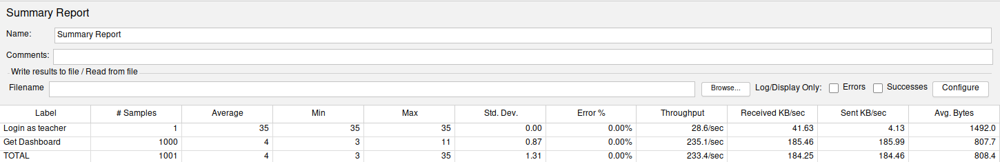
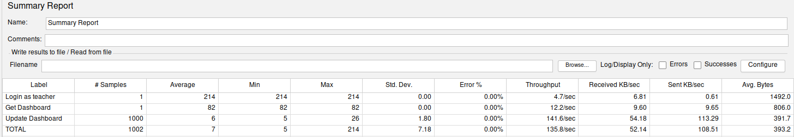
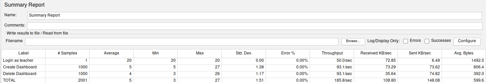

# ES P3 submission, Group 39

## Did your group use the base code provided?

Yes

## Feature ESA

### Subgroup
 - Carlota Tracana, ist199059, [GitLab link](https://gitlab.rnl.tecnico.ulisboa.pt/ist199059)
   + Issues assigned:
	 [#55](https://gitlab.rnl.tecnico.ulisboa.pt/es/es23-39/-/issues/55),
	 [#58](https://gitlab.rnl.tecnico.ulisboa.pt/es/es23-39/-/issues/58),
	 [#63](https://gitlab.rnl.tecnico.ulisboa.pt/es/es23-39/-/issues/63)
 - Henrique Silva, ist199082, [GitLab link](https://gitlab.rnl.tecnico.ulisboa.pt/ist199082)
   + Issues assigned:
	 [#55](https://gitlab.rnl.tecnico.ulisboa.pt/es/es23-39/-/issues/55),
	 [#59](https://gitlab.rnl.tecnico.ulisboa.pt/es/es23-39/-/issues/59),
	 [#62](https://gitlab.rnl.tecnico.ulisboa.pt/es/es23-39/-/issues/62)

### Merge requests associated with this feature

The list of pull requests associated with this feature is:

 - [MR #18](https://gitlab.rnl.tecnico.ulisboa.pt/es/es23-39/-/merge_requests/18)

---

## Feature ESQ

### Subgroup
 - Carlota Barradas, ist199060, [GitLab link](https://gitlab.rnl.tecnico.ulisboa.pt/ist199060)
   + Issues assigned:
	 [#55](https://gitlab.rnl.tecnico.ulisboa.pt/es/es23-39/-/issues/55),
	 [#61](https://gitlab.rnl.tecnico.ulisboa.pt/es/es23-39/-/issues/61)
 - Pedro Lobo, ist199115, [GitLab link](https://gitlab.rnl.tecnico.ulisboa.pt/ist199115)
   + Issues assigned:
	 [#55](https://gitlab.rnl.tecnico.ulisboa.pt/es/es23-39/-/issues/55),
	 [#56](https://gitlab.rnl.tecnico.ulisboa.pt/es/es23-39/-/issues/56),
	 [#66](https://gitlab.rnl.tecnico.ulisboa.pt/es/es23-39/-/issues/66),
	 [#67](https://gitlab.rnl.tecnico.ulisboa.pt/es/es23-39/-/issues/67),
	 [#68](https://gitlab.rnl.tecnico.ulisboa.pt/es/es23-39/-/issues/68),
	 [#69](https://gitlab.rnl.tecnico.ulisboa.pt/es/es23-39/-/issues/69),
	 [#70](https://gitlab.rnl.tecnico.ulisboa.pt/es/es23-39/-/issues/70),
	 [#71](https://gitlab.rnl.tecnico.ulisboa.pt/es/es23-39/-/issues/71),
	 [#72](https://gitlab.rnl.tecnico.ulisboa.pt/es/es23-39/-/issues/72)

### Merge requests associated with this feature

The list of pull requests associated with this feature is:

 - [MR #18](https://gitlab.rnl.tecnico.ulisboa.pt/es/es23-39/-/merge_requests/18)

---

## Feature ESP

### Subgroup
 - André Torres, ist199053, [GitLab link](https://gitlab.rnl.tecnico.ulisboa.pt/ist199053)
   + Issues assigned:
	 [#55](https://gitlab.rnl.tecnico.ulisboa.pt/es/es23-39/-/issues/55),
	 [#57](https://gitlab.rnl.tecnico.ulisboa.pt/es/es23-39/-/issues/57),
	 [#65](https://gitlab.rnl.tecnico.ulisboa.pt/es/es23-39/-/issues/65)
 - Gonçalo Nunes, ist199074, [GitLab link](https://gitlab.rnl.tecnico.ulisboa.pt/ist199074)
   + Issues assigned:
	 [#55](https://gitlab.rnl.tecnico.ulisboa.pt/es/es23-39/-/issues/55),
	 [#60](https://gitlab.rnl.tecnico.ulisboa.pt/es/es23-39/-/issues/60),
	 [#64](https://gitlab.rnl.tecnico.ulisboa.pt/es/es23-39/-/issues/64)

### Merge requests associated with this feature

The list of pull requests associated with this feature is:

 - [MR #18](https://gitlab.rnl.tecnico.ulisboa.pt/es/es23-39/-/merge_requests/18)

---

## JMeter Load test

  - JMeter test: Get 
  - JMeter test: Update 
  - JMeter test: Create → Remove 

## Cypress end-to-end tests

- Data initialization: The data was initialized using SQL queries, located in
  the [`database.js`](https://gitlab.rnl.tecnico.ulisboa.pt/es/es23-39/-/blob/master/frontend/tests/e2e/support/database.js)
  file.

- [Cypress tests](https://gitlab.rnl.tecnico.ulisboa.pt/es/es23-39/-/tree/master/frontend/tests/e2e/specs/dashboard/teacherStats.js)
